# **Configurar Base de Datos Relacional en modelo IaaS**


---
## **Parte I: Instalación base de datos relacional en modelo de Infraestructura como Servicio**

## *Paso 1. Crear la Instancia EC2*

1. Inicia sesión en la Sandbox de laboratorio otorgado por tu docente.

2. Ve a **Servicios > EC2 > Instancias > Lanzar instancia**.

3. Configura la instancia:
   - **Nombre**: `postgres_engine`.
   - **AMI**: Selecciona **Amazon Linux 2023 AMI**.

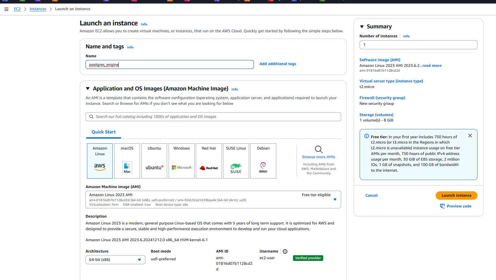

   - **Tipo de instancia**: `t2.micro`, cumple con el mínimo de RAM solicitado (1GiB)
   - **Key Pair**: Crear una llave o seleccionar existente a la que usted tenga acceso.

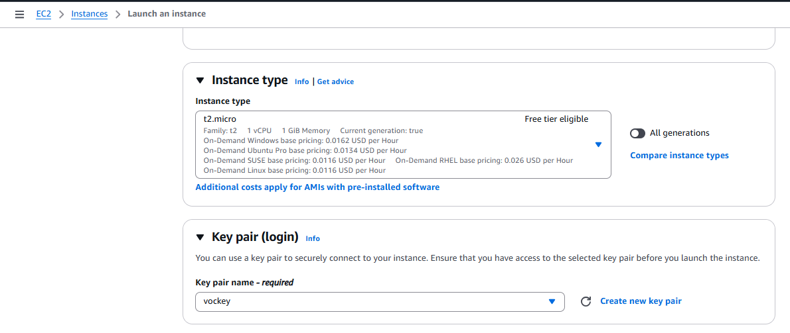

##

4. Redes y Grupo de Seguridad.

   - **Configuración de red**:
      - Tipo de red: Usar **VPC por defecto** y **red pública** ofrecida por el ambiente Sandbox. 
      - Asegúrese de que la **IP pública** quede habilitada para la instancia.
   - **Para el Security Group**:
      - **Nombre**: `sgrp_bd`
      - Abre el puerto `22` (SSH).
      - Abre el puerto `5432` para tu IP pública (PostgreSQL).
      - Si lo requiere, también puede abrir también ICMP para pruebas de conectividad.
      - Puede permitir todas las conexiones para cada puerto, sin embargo, siempre tenga en cuenta que **las reglas cuyo origen es 0.0.0.0/0 o ::/0 permiten a todas las direcciones IP acceder a la instancia**. El proveedor recomienda **como buena práctica, configurar reglas de grupo de seguridad para permitir el acceso únicamente desde direcciones IP conocidas**.


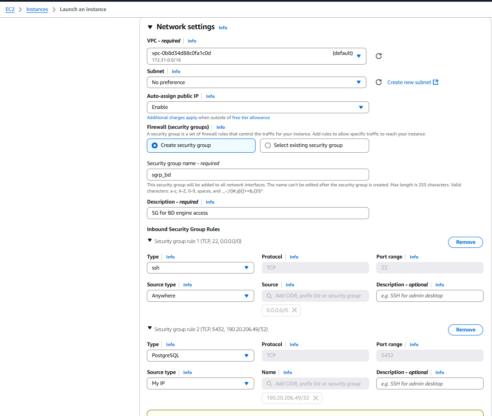

<!-- 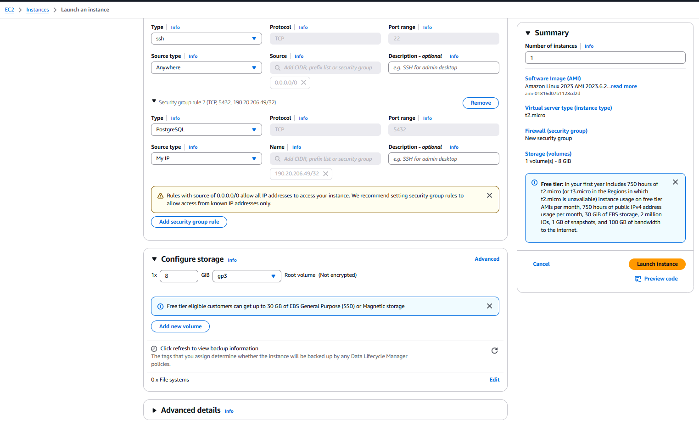 -->

##

5. **Almacenamiento EBS**: 

- Configurar al menos 12 GiB de almacenamiento EBS. 

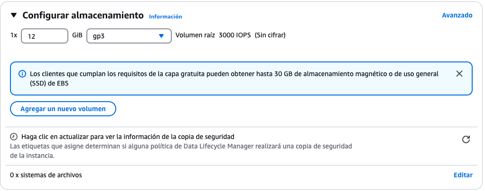


<!-- - En el ejemplo de instancia ya lanzada se observan el tamaño de volumen solicitado.

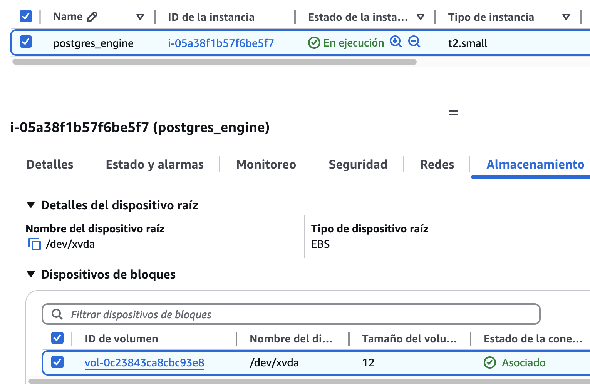 -->

##

6. Si está conforme con las configuraciones lance la instancia y espere a su estado sea `En ejecución`.

- Resumen de la configuración.

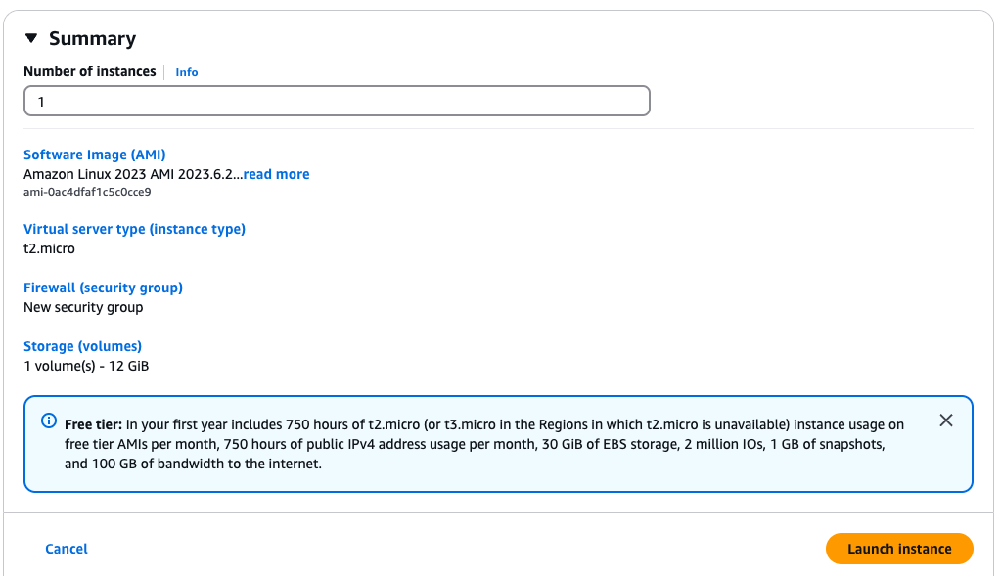

- Instancia en ejecución.

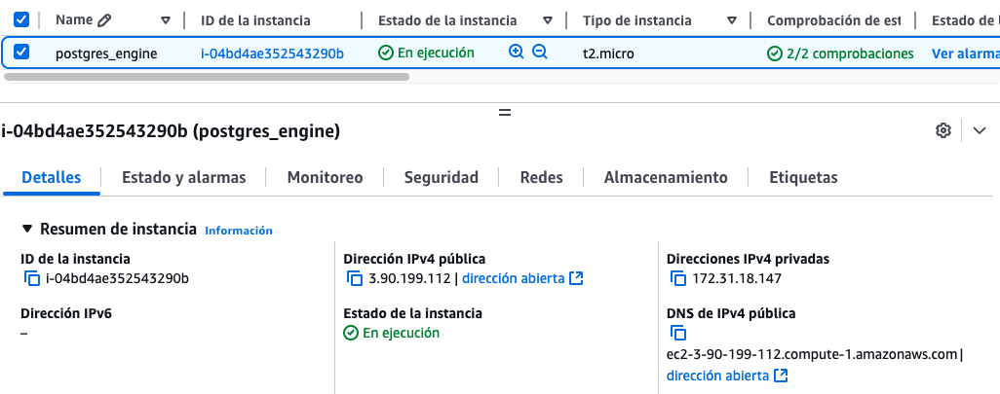

##


## *Paso 2. Conectarse a la Instancia EC2 e instalar PostgreSQL*


1. Defina junto a su docente, la forma más adecuada para conectar a la instancia de cómputo para instalar y configurar el motor de base de datos. 

- Las opciones a considerar serían:
   - Mediante **SSH**.
   - Usando la **Conexión de la instancia EC2 browser-based**.
   - Usando el **LabRole** en la instancia para el Administración de Sesiones.
- La forma más adecuada dependerá de si utiliza Sandbox Environment del curso de `AWS Academy Cloud Foundations` o `AWS Academy Learner Lab`. 
- En este caso se usará **Conexión de la instancia EC2 usando cliente browser-based**.

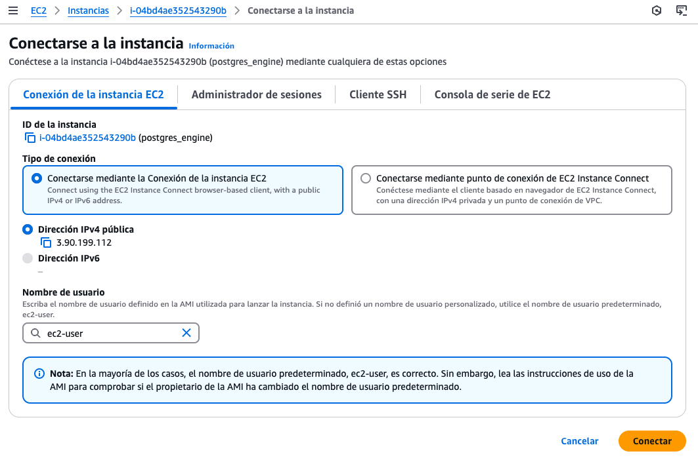


- Conexión usando cliente browser-based:

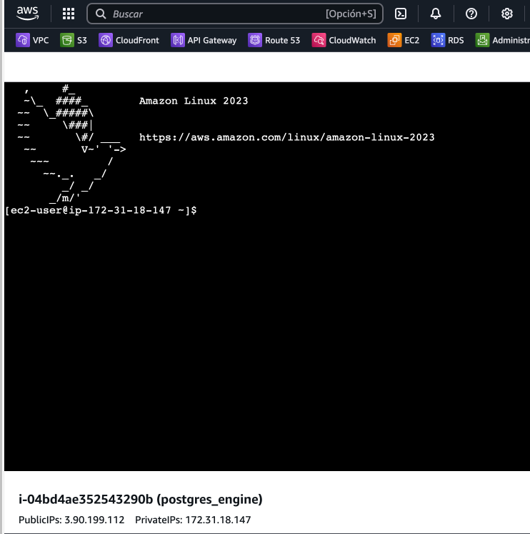

##
2. Instalación del motor en la instancia:

- Se actualizan paquetes dentro de la instancia y se instala la versión 16 PostgreSQL.
- Se inicializa el setup de PostgreSQL para crear las estructuras necesarias (directorios y archivos) y que este funcione correctamente.
- Se inicia manualmente el servicio de PostgreSQL y se habilita para que este arranque automáticamente en el sistema en cada inicio.
- Se chequea el estado del sevicio para verificar que esté corriendo (running).

```bash
sudo dnf update
sudo dnf upgrade
sudo dnf install postgresql16 postgresql16-server -y
sudo postgresql-setup --initdb
sudo systemctl start postgresql
sudo systemctl enable postgresql
sudo systemctl status postgresql
 ```

- Si realiza este punto correctamente debería ver que el servicio de PostgreSQL esté corriendo (running). 

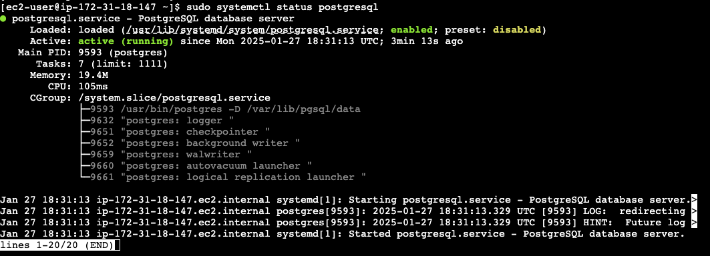

Para salir use `Ctrl + C`.

##

3. Configurar una contraseña:

- Configurar una contraseña al usuario por defecto llamado `postgres`.

```bash
sudo -u postgres psql
```

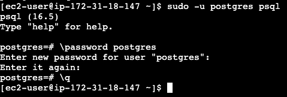

```bash
\password postgres
#Configurar contraseña y salir con \q
```
##
4. Respaldar y configurar archivo `postgresql.conf`:

En el archivo `postgresql.conf`, se controla en qué interfaces de red PostgreSQL escuchará conexiones entrantes.

Debe:

- Respaldar archivo `postgresql.conf`. Para conservar archivo original en caso de algún error o problema.
- Verificar que el archivo original y copia se encuentren en el directorio.
- Modificar archivo `postgresql.conf` usando un editor de texto como `vi` o `vim`.

```bash
sudo cp /var/lib/pgsql/data/postgresql.conf /var/lib/pgsql/data/postgresql.conf.back
sudo ls -l /var/lib/pgsql/data/
sudo vim /var/lib/pgsql/data/postgresql.conf
```
- Editar en la línea 60 el archivo `postgresql.conf` las direcciones de escucha del servicio. 
- Para este caso abriremos todas las conexiones, sin embargo, por seguridad se recomienda que defina una IP específica.
- Por defecto tiene `localhost`, se debe descomentar la línea y cambiar a `*`, abriendo así a todas las direcciones entrantes posibles y guardar los cambios.

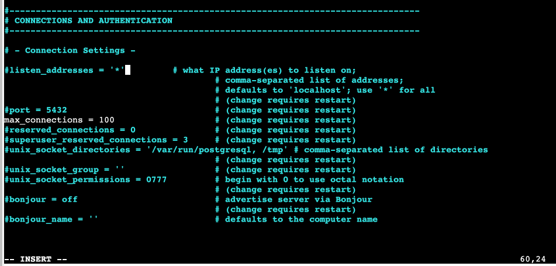

##
5. Respaldar y configurar archivo `pg_hba.conf`:

En el archivo `pg_hba.conf`, se controla quién puede conectarse y cómo se autentican los clientes a PostgreSQL. Aquí se definen reglas de autenticación basadas en IP, usuario y base de datos.

Debe:

- Respaldar archivo `pg_hba.conf`. Para conservar archivo original en caso de algún error o problema.
- Verificar que el archivo original y copia se encuentren en el directorio.
- Modificar archivo `pg_hba.conf` usando un editor de texto como `vi` o `vim`.

```bash 
sudo cp /var/lib/pgsql/data/pg_hba.conf /var/lib/pgsql/data/pg_hba.conf.back
sudo ls -l /var/lib/pgsql/data/
sudo vim /var/lib/pgsql/data/pg_hba.conf
```
- Al final del archivo `pg_hba.conf` agregar configuración de la autenticación del cliente y guarde los cambios.

```bash
 # TYPE  DATABASE    USER    ADDRESS             METHOD
#Autenticacion cliente remoto a la BD
host    all         all     0.0.0.0/0         md5
```

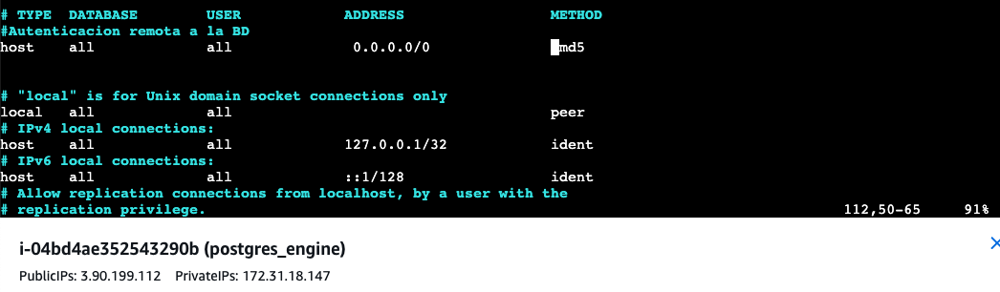

##
6. Reinicie el servicio y pruebe conectividad:

- Reiniciar el servicio para que apliquen los cambios realizados en los puntos atenriores.

```bash
sudo systemctl restart postgresql
```

- Regrese a la consola de AWS, identifique la IP pública de su instancia y copiela. 
- En este caso de ejemplo, la IPv4 pública es `54.152.105.146`.

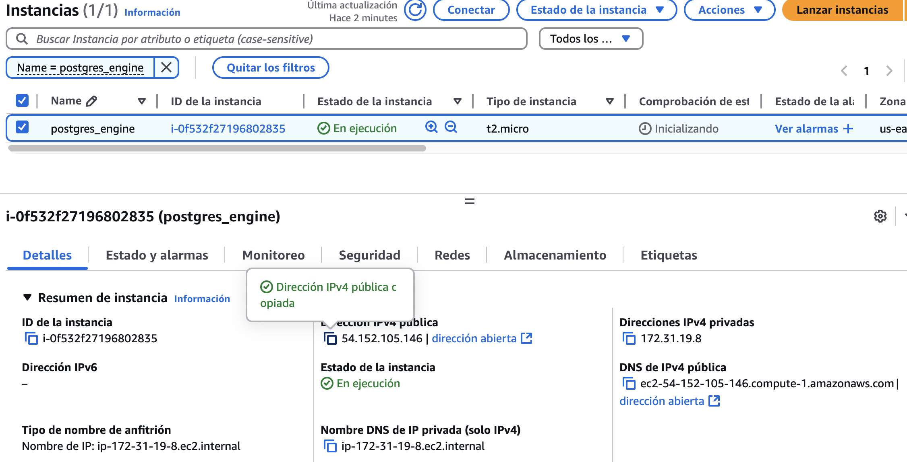

- Utilizando la IP pública obtenida, desde su entorno local realice pruebas de conectividad de red hacia el motor usando ping o telnet.
- Para este caso, siempre fíjese en el valor de la IP pública asignada antes de probar, pues en esta forma de implementación la IP pública es dinámica y puede haber cambiado el por algún motivo (como por ejemplo, apagar unos segundos la instancia EC2 y luego iniciarla nuevamente).
- Si las pruebas responden correctamente puede continuar a la Parte II. En su defecto, regrese a las configuraciones anteriores para verificar que no haya comentido algún error o saltado algún paso.

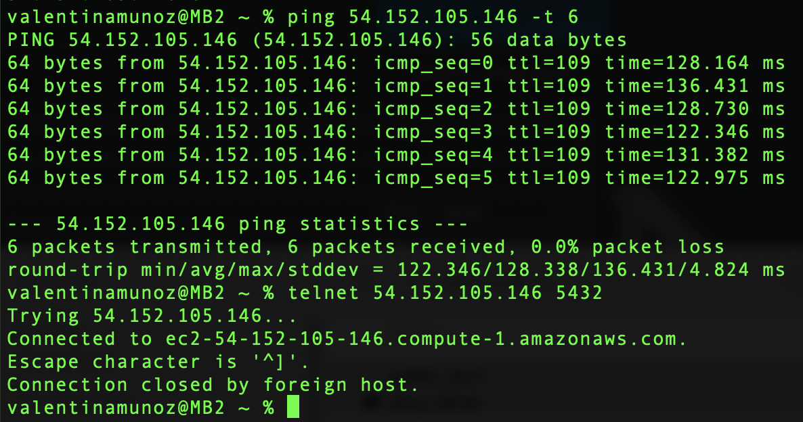

---

## **Parte II: Conectarse al motor de PostgreSQL y utilizar lenguaje SQL**

## *Paso 1. Conectar a la Base de datos*

1. En este ejemplo se utiliza cliente GUI de base de datos DBeaver para realizar la conexión. Se crea una nueva conexión se ajustan las siguientes propiedades de conexión:

- Host: Dato obtenido desde su IP pública en la consola de AWS.
- Database: `postgres` -> Esta  database es creada por defecto.
- Port: 5432 -> Puerto por defecto para PostgreSQL.
- Nombre usuario: `postgres` -> Usuario por defecto.
- Contraseña: Usar la que usted definió en la Parte I.

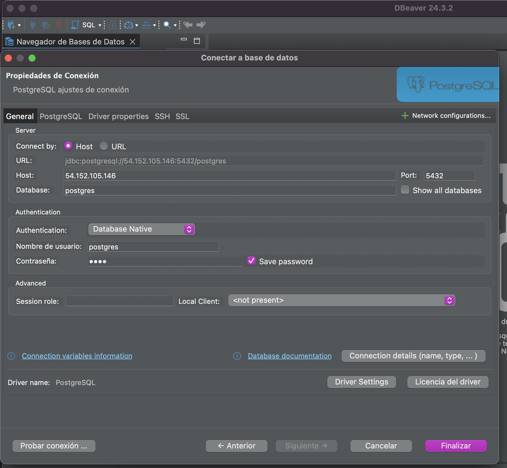

##
2. Teniendo los datos de la conexión configurados, realice un test con el botón de `Probar conexión ...`.

- Si en el test le aparece `Conectado` haga click en `Aceptar` y luego en `Finalizar`.
- Si en el test no le aparece `Conectado` revise las propiedades de conexión o de red.

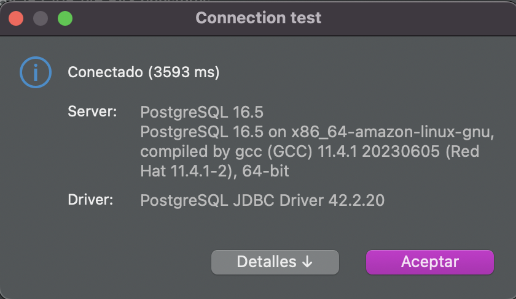

##
3. Haga doble click en su nueva bases de datos en el `Navegador de Bases de Datos` y expándala. Luego abra un nuevo `Script SQL`.

- En este punto, ya está preparado/a para realizar operaciones SQL.

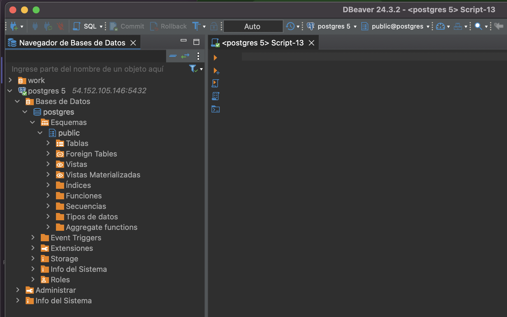

##

## *Paso 2. Realizar operaciones utilizando lenguaje SQL.*

1. Realice operciones de:
- CREATE TABLE
- SELECT
- INSERT INTO
- DELETE FROM

2. Puede revisar el ejemplo en el [archivo](example.sql) alojado en este repositorio.
